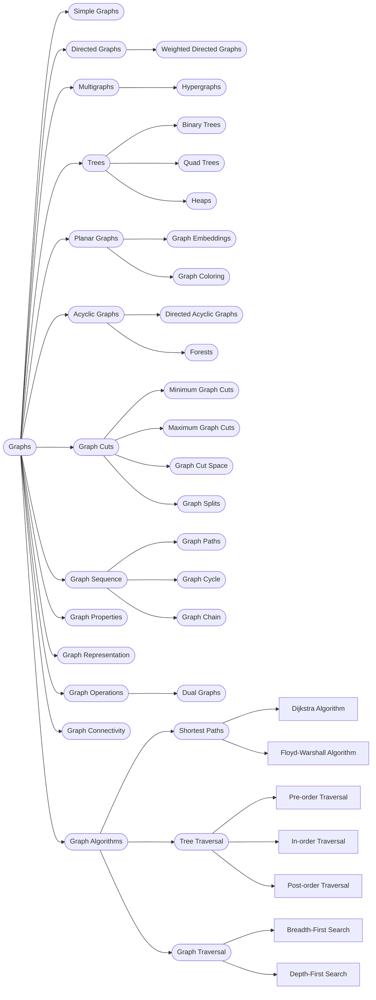
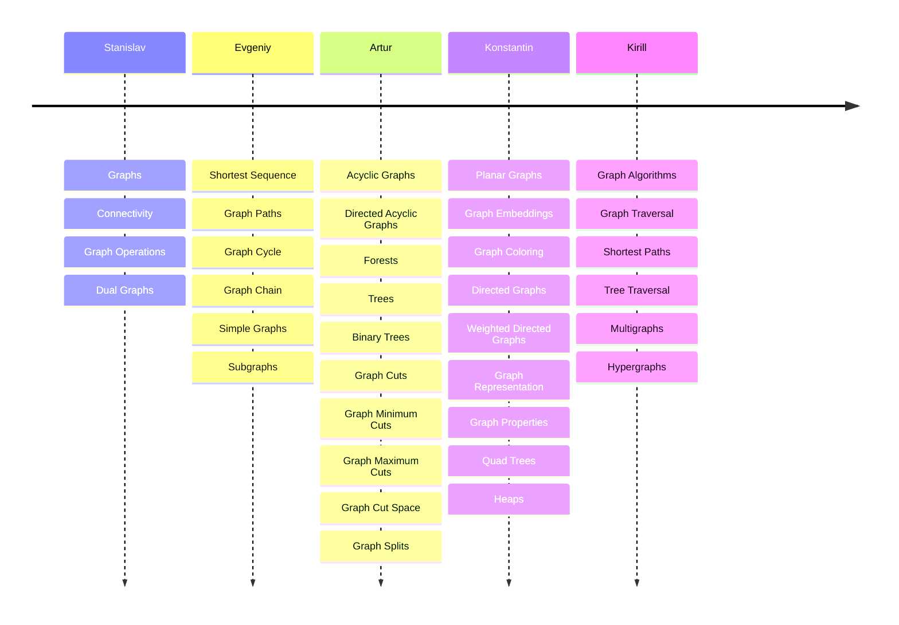

## Graph theory subject domains hierarchy

```mermaid
graph LR;
  Graphs([Graphs])
  Graphs --> Simple_Graphs([Simple Graphs])
  Graphs --> Directed_Graphs([Directed Graphs])
  Graphs --> Multigraphs([Multigraphs])
  Graphs --> Trees([Trees])
  Graphs --> Planar_Graphs([Planar Graphs])
  Graphs --> Acyclic_Graphs([Acyclic Graphs])
  Graphs --> Graph_Cuts([Graph Cuts])
  Graphs --> Graph_Sequence([Graph Sequence])
  Graphs --> Graph_Properties([Graph Properties])
  Graphs --> Graph_Representation([Graph Representation])
  Graphs --> Graph_Operations([Graph Operations])
  Graphs --> Graph_Connectivity([Graph Connectivity])
  Graphs --> Graph_Algorithms([Graph Algorithms])

  Directed_Graphs --> Weighted_Directed_Graphs([Weighted Directed Graphs])

  Multigraphs --> Hypergraphs([Hypergraphs])

  Trees --> Binary_Trees([Binary Trees])
  Trees --> Quad_Trees([Quad Trees])
  Trees --> Heaps([Heaps])

  Planar_Graphs --> Graph_Embeddings([Graph Embeddings])
  Planar_Graphs --> Graph_Coloring([Graph Coloring])

  Acyclic_Graphs --> Directed_Acyclic_Graphs([Directed Acyclic Graphs])
  Acyclic_Graphs --> Forests([Forests])

  Graph_Cuts --> Minimum_Graph_Cuts([Minimum Graph Cuts])
  Graph_Cuts --> Maximum_Graph_Cuts([Maximum Graph Cuts])
  Graph_Cuts --> Graph_Cut_Space([Graph Cut Space])
  Graph_Cuts --> Graph_Splits([Graph Splits])

  Graph_Sequence --> Graph_Paths([Graph Paths])
  Graph_Sequence --> Graph_Cycle([Graph Cycle])
  Graph_Sequence --> Graph_Chain([Graph Chain])

  Graph_Operations --> Dual_Graphs([Dual Graphs])

  Graph_Algorithms --> Shortest_Paths([Shortest Paths])
  Graph_Algorithms --> Tree_Traversal([Tree Traversal])
  Graph_Algorithms --> Graph_Traversal([Graph Traversal])

  Shortest_Paths --> Dijkstra_Algorithm[Dijkstra Algorithm]
  Shortest_Paths --> Floyd_Warshall_Algorithm[Floyd-Warshall Algorithm]

  Tree_Traversal --> Pre_order_Traversal[Pre-order Traversal]
  Tree_Traversal --> In_order_Traversal[In-order Traversal]
  Tree_Traversal --> Post_order_Traversal[Post-order Traversal]

  Graph_Traversal --> Breadth_First_Search[Breadth-First Search]
  Graph_Traversal --> Depth_First_Search[Depth-First Search]
```

## Distribution

```mermaid
timeline
  Stanislav
    : Graphs
    : Connectivity
    : Graph Operations
    : Dual Graphs
  Evgeniy
    : Shortest Sequence
    : Graph Paths
    : Graph Cycle
    : Graph Chain
    : Simple Graphs
    : Subgraphs
  Artur
    : Acyclic Graphs
    : Directed Acyclic Graphs
    : Forests
    : Trees
    : Binary Trees
    : Graph Cuts
    : Graph Minimum Cuts
    : Graph Maximum Cuts
    : Graph Cut Space
    : Graph Splits
  Konstantin
    : Planar Graphs
    : Graph Embeddings
    : Graph Coloring
    : Directed Graphs
    : Weighted Directed Graphs
    : Graph Representation
    : Graph Properties
    : Quad Trees
    : Heaps
  Kirill
    : Graph Algorithms
    : Graph Traversal
    : Shortest Paths
    : Tree Traversal
    : Multigraphs
    : Hypergraphs
```
